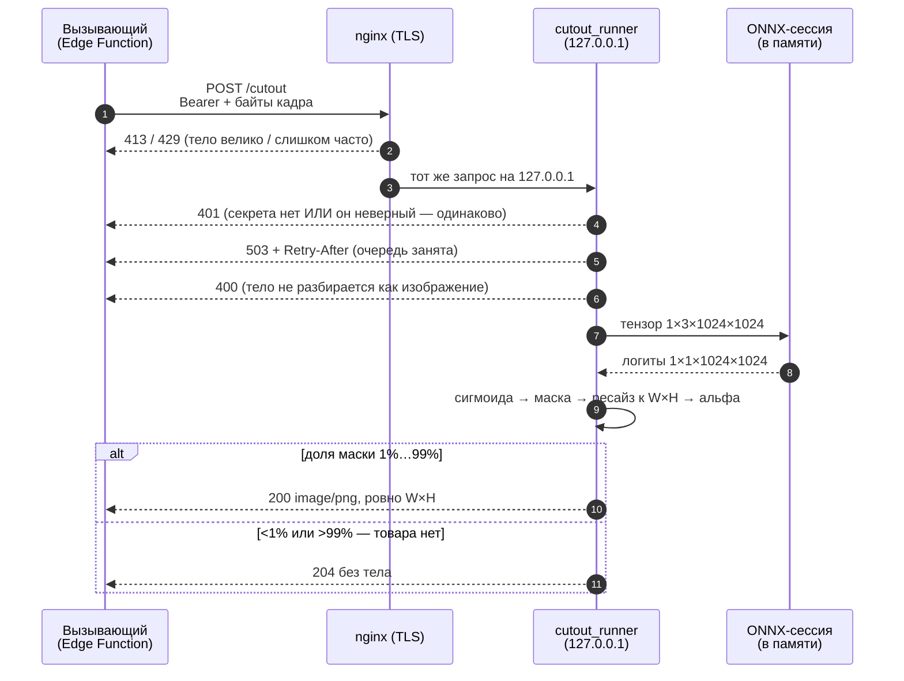
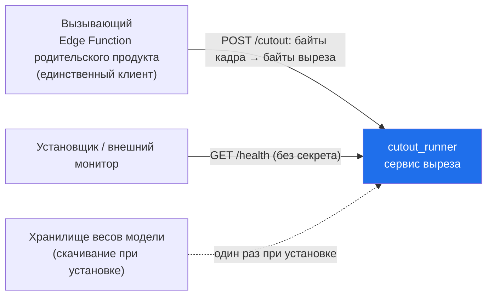
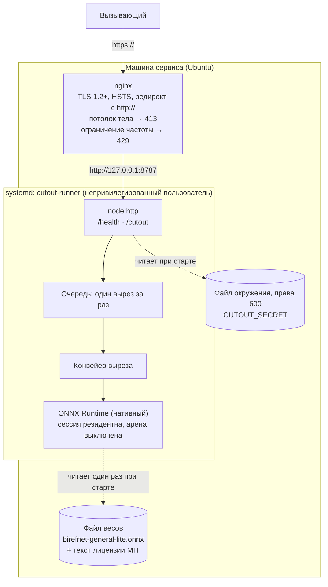
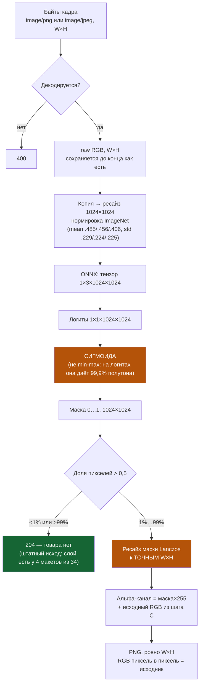
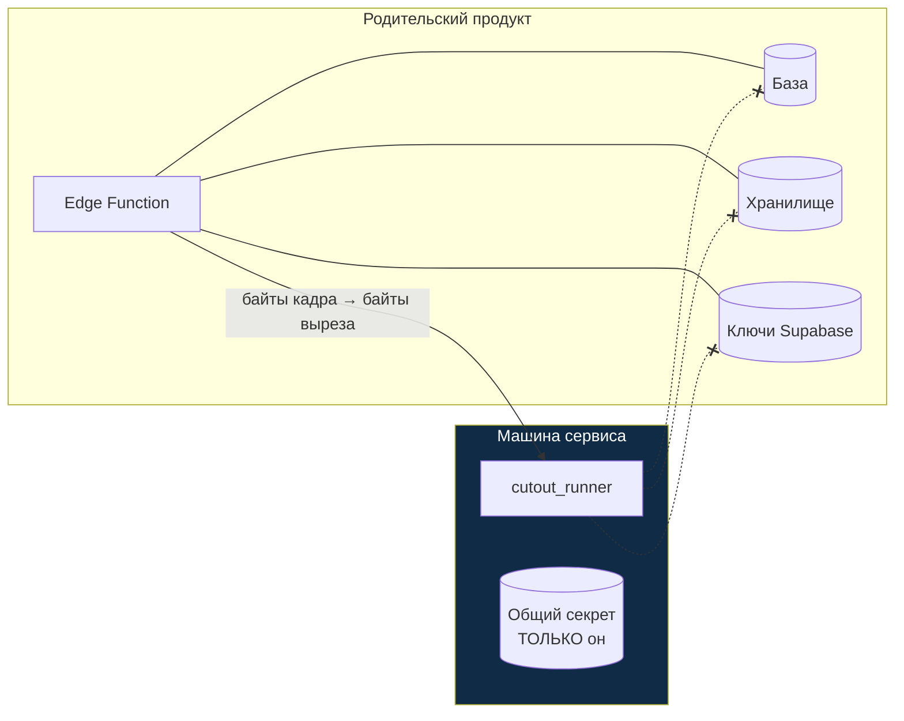
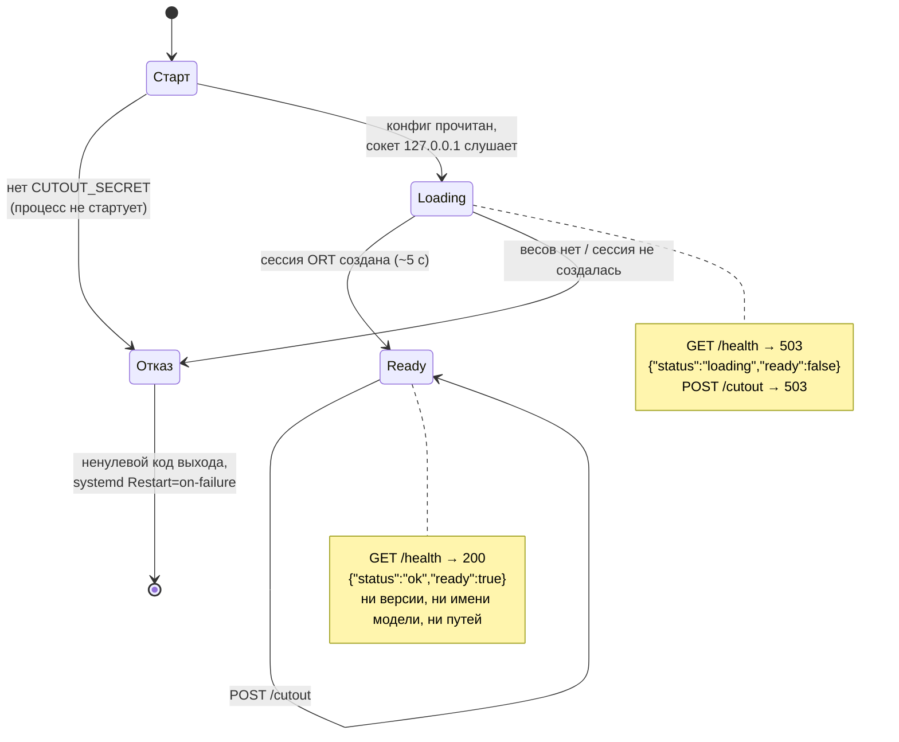

# VISUALS — визуальный артефакт `cutout_runner`

Status: DRAFT (собрано из [`../PLAN.md`](../PLAN.md) — вход docs-first, 2026-09-04) · Слой: **как это выглядит и как связано**

> ## ⚠ Правило единственности — читать до правки
>
> **Это единственный визуальный артефакт проекта.** Все схемы, диаграммы, скриншоты
> референсов и макеты живут здесь и больше нигде.
>
> - Файл **переписывается на месте**. Файлов `VISUALS_v2.md`, `СХЕМЫ.md`,
>   `SPEC_диаграммы.md` **не существует** и заводить их запрещено.
> - `TZ.md` и `SPEC.md` на визуалы **ссылаются** (`[V-03](VISUALS.md#v-03)`), а не копируют.
> - **Правка визуала обновляет и визуал, и все ссылающиеся пункты** — в одном изменении.
> - У каждого визуала **стабильный ID `V-NN`**. ID не переиспользуется после удаления.
> - **Схемы — текстом (Mermaid), не картинкой.**
>
> Обоснование — [ADR-0004](adr/0004-single-visual-artifact.md).

---

## Реестр визуалов

| ID | Название | Тип | Что показывает | Ссылаются |
| --- | --- | --- | --- | --- |
| [V-01](#v-01) | Главный сценарий | Mermaid sequence | Путь одного запроса: кадр → вырез, 204 или отказ | `TZ.md` US-01 |
| [V-02](#v-02) | Контекст системы | Mermaid (C4 L1) | Сервис и внешний мир: кто с ним разговаривает | `SPEC.md` §1 |
| [V-03](#v-03) | Контейнеры | Mermaid (C4 L2) | Из чего состоит машина сервиса и что где стоит | `SPEC.md` §1, §3 |
| [V-04](#v-04) | Конвейер выреза | Mermaid flowchart | Байты кадра → тензор → логиты → альфа → PNG, с развилкой «выреза нет» | `SPEC.md` §1, §3; `TZ.md` FR-04…FR-07 |
| [V-05](#v-05) | Граница доверия | Mermaid flowchart | Что есть и чего **нет** на машине сервиса | `TZ.md` §8, ADR-0006 |
| [V-06](#v-06) | Состояния сервиса | Mermaid state | `loading` → `ready`, и что отвечает `/health` | `TZ.md` US-02 |

---

## V-01 — Главный сценарий

Что показывает: один вызов `POST /cutout` целиком, включая оба штатных исхода и оба отказа.

## V-02 — Контекст системы (C4 уровень 1)

Что показывает: сервис как один блок и всё, что с ним разговаривает снаружи.

> Родительского хранилища и базы на схеме **нет намеренно** — см. [V-05](#v-05).

## V-03 — Контейнеры (C4 уровень 2)

Что показывает: что стоит на машине сервиса и где проходит сетевая граница.

## V-04 — Конвейер выреза

Что показывает: превращение байтов кадра в байты выреза и точку, где рождается 204.

> Оранжевым отмечены два шага, ошибка в которых **не видна на глаз** и всплывает уже на готовой
> карточке: неверная активация (`TZ.md` FR-04) и неточный размер маски (`TZ.md` FR-05).

## V-05 — Граница доверия

Что показывает: чего на машине сервиса **нет** — это и есть содержание решения
[ADR-0006](adr/0006-service-trust-boundary.md).

> Пунктир с крестом — связи, которых **не существует и не должно появиться**. Взлом машины даёт
> кадры, которые через неё прошли, — и ничего больше. Ради этого свойства кадр и пересылается
> целиком, вместо ссылки на хранилище.

## V-06 — Состояния сервиса

Что показывает: почему `/health` бывает 503 и когда становится 200.

---

## Референсы

Референс-приложений у проекта нет: контракт задан родительским продуктом, а не чужим
интерфейсом. Единственный внешний код, с которым сверялась реализация, — сессия
`birefnet_general` из `rembg` (источник входного размера 1024×1024 и нормировки ImageNet).
**Что берём:** размер входа и нормировку. **Что не берём:** min-max поверх сигмоиды —
обоснование в [`SPEC.md`](SPEC.md) §9.
