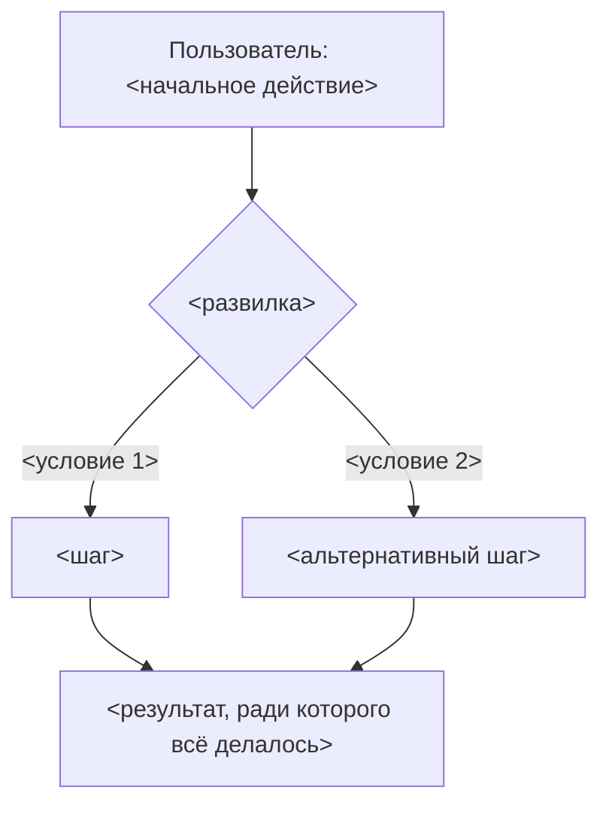
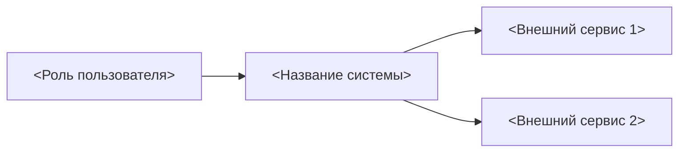
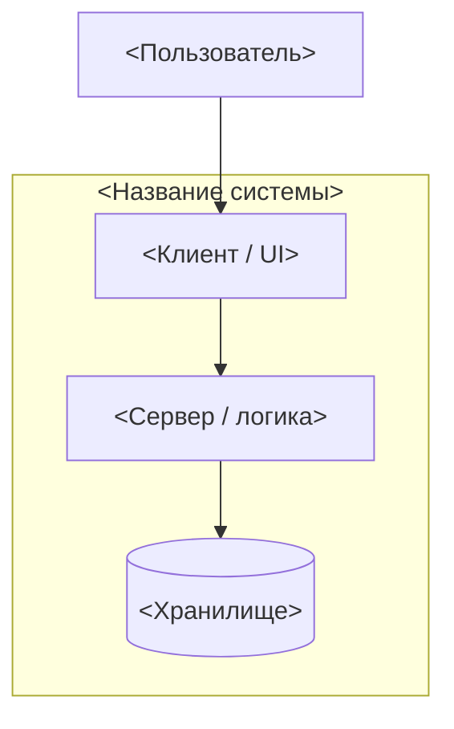
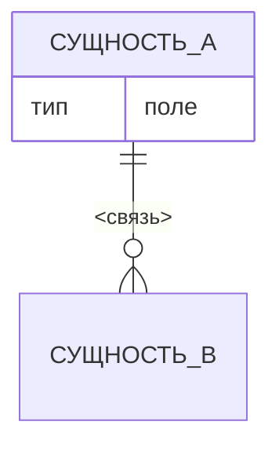
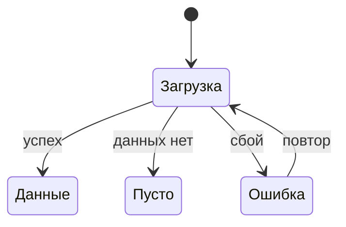

# VISUALS — визуальный артефакт проекта

Status: DRAFT (черновик интейка от <YYYY-MM-DD>) · Слой: **как это выглядит и как связано**

> ## ⚠ Правило единственности — читать до правки
>
> **Это единственный визуальный артефакт проекта.** Все схемы, диаграммы, скриншоты
> референсов и макеты живут здесь и больше нигде.
>
> - Файл **переписывается на месте**. Файлов `VISUALS_v2.md`, `VISUALS_old.md`,
>   `СХЕМЫ.md`, `SPEC_диаграммы.md` **не существует** и заводить их запрещено.
> - `TZ.md` и `SPEC.md` на визуалы **ссылаются** (`[V-03](VISUALS.md#v-03)`), а не копируют их.
>   Копия схемы в другом документе = второй источник истины, который разъедется.
> - **Правка визуала обновляет и визуал, и все ссылающиеся на него пункты** — в одном
>   изменении. Список ссылающихся держится в реестре ниже.
> - У каждого визуала **стабильный ID `V-NN`**. ID не переиспользуется после удаления —
>   удалённый помечается в реестре как снятый, чтобы старые ссылки не указывали на чужую схему.
> - **Схемы — текстом (Mermaid), не картинкой.** Текст диффится и правится точечно;
>   экспортированная картинка требует внешнего редактора и порождает вопрос «какая свежая».
>   Картинками остаётся только то, что картинкой и является: скриншоты, фото, макеты.
>
> Обоснование — [ADR-0004](adr/0004-single-visual-artifact.md).

**Как адресовать правку:** «на схеме V-03 добавь шаг X» / «референс V-07 больше не берём».
Этого достаточно — исполнитель найдёт визуал по ID, поправит его и синхронизирует ссылки.

---

## Реестр визуалов

| ID | Название | Тип | Что показывает | Ссылаются |
| --- | --- | --- | --- | --- |
| [V-01](#v-01) | Главный сценарий | Mermaid flowchart | Поток пользователя от начала до результата | `TZ.md` US-01 |
| [V-02](#v-02) | Контекст системы | Mermaid (C4 L1) | Система и внешний мир: кто и что с ней взаимодействует | `SPEC.md` §Архитектура |
| [V-03](#v-03) | Контейнеры | Mermaid (C4 L2) | Из каких приложений/хранилищ состоит система | `SPEC.md` §Архитектура, §Модули |
| [V-04](#v-04) | Модель данных | Mermaid ER | Сущности и связи | `TZ.md` §7, `SPEC.md` §Данные |
| [V-05](#v-05) | Референсы | Скриншоты/ссылки | Примеры «как должно быть» с разбором | `TZ.md` §1, `SPEC.md` §Опыт |
| [V-06](#v-06) | Состояния экранов | Mermaid state | Загрузка · пусто · ошибка | `TZ.md` §4 |

> Строку в реестре заводить **в том же изменении**, что и сам визуал, — как строку в
> `planning/INDEX.md`. Реестр — то, по чему проверяется, что ссылки не осиротели.

---

## V-01 — Главный сценарий

Что показывает: путь главной роли из `TZ.md` §2 через главный сценарий US-01.

> TODO(пользователь): подтвердить, что поток совпадает с тем, как ты это себе представляешь.

## V-02 — Контекст системы (C4 уровень 1)

Что показывает: система целиком как один блок + все, кто с ней разговаривает снаружи.

## V-03 — Контейнеры (C4 уровень 2)

Что показывает: из каких запускаемых частей и хранилищ состоит система и как они связаны.

> Уровень C4 **L3 (компоненты)** добавлять только для модуля с нетривиальным устройством.
> **L4 (код) не рисуем** — устаревает быстрее, чем пишется.

## V-04 — Модель данных

## V-05 — Референсы

> Каждый референс — с разбором. «Хочу как у них» без разбора превращается в копирование
> случайных решений, включая их ошибки.

### V-05.1 — <название референса>

- **Что это:** <ссылка или файл>
- **Скриншот:** ``
- **Берём:** <конкретно что и почему>
- **Не берём:** <конкретно что и почему>

## V-06 — Состояния экранов

Три состояния, про которые забывают чаще всего. Для не-UI проектов раздел удаляется целиком.

---

## Изображения

Бинарники (скриншоты, фото, макеты) — в [`assets/`](assets/), имя файла привязано к ID
визуала: `v-05-1-<slug>.png`. Так по имени файла видно, к какой схеме он относится, и
осиротевшие файлы находятся глазами.

Форматы: PNG/JPG для растра, SVG для векторных макетов. Крупные исходники (Figma, PSD) в
репозиторий не кладутся — вместо них ссылка + экспортированный скриншот.

## Как править

1. Найти визуал по ID (`V-NN`).
2. Поправить его **здесь**, на месте. Не создавать копию, не заводить второй файл.
3. Обновить строку реестра, если изменилось назначение схемы.
4. Пройти по колонке «Ссылаются» и синхронизировать пункты в `TZ.md` / `SPEC.md` —
   **в том же изменении**.
5. Если правка меняет требование, а не только картинку, — правится и требование в `TZ.md`.

## Связанные документы

| Документ | Что там |
| --- | --- |
| [`TZ.md`](TZ.md) | Требования — что и зачем |
| [`SPEC.md`](SPEC.md) | Спецификация — как устроено |
| [`adr/0004-single-visual-artifact.md`](adr/0004-single-visual-artifact.md) | Почему визуальный слой — один файл |
